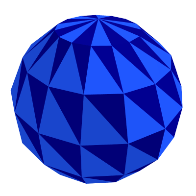

# spheriod-mesh-generate
Spheroid Mesh Generation and Visualization Utilities

# Prerequisites

* (Anaconda)[https://www.anaconda.com/] or (miniconda)[https://docs.conda.io/en/latest/miniconda.html]

# Setup
Install prerequisites such as `numpy`, `plotly`, `moviepy`, and `scipy`, and others via `conda`.

```sh
conda create -n "astro" python=3.9 --file requirements.txt
conda activate astro
```

## Start the jupyter notebook
```sh
jupyter notebook globe_mesh_uv.ipynb
```

Run through the notebook to generate interactive 3D charts and .gifs like this:


